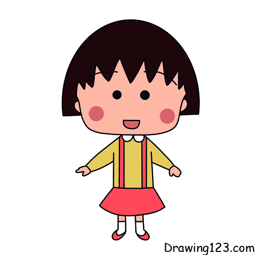
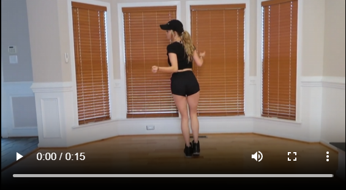

# MocapAnimatedDrawing

This is an application that utilizes 2 projects <a href="https://github.com/facebookresearch/AnimatedDrawings">AnimatedDrawings</a> and <a href="https://github.com/FORTH-ModelBasedTracker/MocapNET">MocapNET</a> that can animate a 2D drawing human form character given a sample motion video in end-to-end manner.

This project also provides Docker image for AnimatedDrawings project.
## How to build it:
Recommended OS (not compulsory): Ubuntu 20.04.6 LTS.

This project is tested with GPU NVIDA GeForce RXT 2060. 
In case you don't have GPU on your machine, considering to adjust this file based on your machine MocapAnimatedDrawing/blob/main/MocapNET/initialize.sh or you can try changing line 235: 

````
# from this
answer="Y"
# to this
answer="N"
````
Also, delete option "--gpus all" at line 30 in file MocapAnimatedDrawing/MocapNET/build_and_deploy.sh

If using Window, commands must be executed in WSL Ubuntu environment, otherwise, It won't work.
````bash
git clone https://github.com/gavotte25/MocapAnimatedDrawing.git
cd MocapAnimatedDrawing
sh build_and_deploy.sh
````
After building completed, check if this server is ready. 
````bash
curl http://localhost:8080/ping

# should return:
# {
#   "status": "Healthy"
# }
````

## How to use it:

Interact with the app via MocapAnimatedDrawing/StaticWeb/index.html.
Note: Because all Docker containers are using SharedVolume folder as a common bind mount and the web pages have reference to that folder, the html files only work when they are placed inside the procject.

If there is any issue related to calling the APIs while all the containers are still running, try restarting the containers and wait for awhile.

Annotation and GIF output of AnimatedDrawings are stored in folder SharedVolume/Annotation
BVH output from MocapNET can be found in folder SharedVolume/Temp

Output files will be overwritten everytime calling APIs

## Example:
Input:

[](http://ammar.gr/mocapnet/shuffle.webm)
Output:

